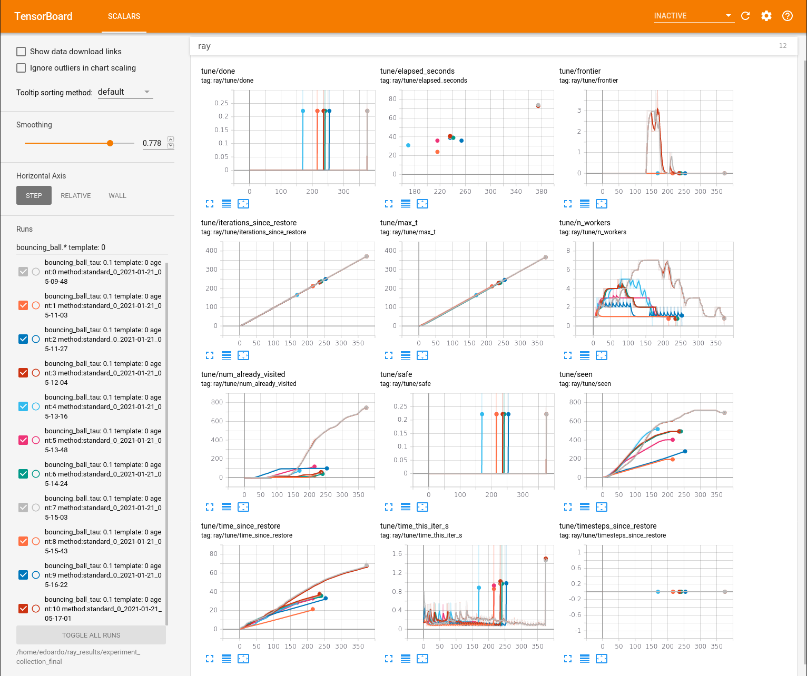

## Getting Started
This repository contains the code used for the following publications:
- _Probabilistic Guarantees for Safe Deep Reinforcement Learning_ (FORMATS 2020)
- _Verifying Reinforcement Learning up to Infinity_ (IJCAI 2021)
- _Verified Probabilistic Policies for Deep Reinforcement Learning_ (NFM 2022)

These instructions will help with setting up the project

### Prerequisites
Create a virtual environment with conda:
```
conda env create -f environment.yml
conda activate safedrl
```
This will take care of installing all the dependencies needed by python

In addition, download PRISM from the following link: https://github.com/phate09/prism

Ensure you have Gradle installed (https://gradle.org/install/) 

## Running the code
Before running any code, in a new terminal go to the PRISM project folder and run
```
gradle run
``` 
This will enable the communication channel between PRISM and the rest of the repository
### _Probabilistic Guarantees for Safe Deep Reinforcement Learning_ (FORMATS 2020)

#### Training
Run the ``train_pendulum.py`` inside ``agents/dqn`` to train the agent on the inverted pendulum problem and record the location of the saved agent

#### Analysis
Run the ``domain_analysis_sym.py`` inside ``runnables/symbolic/dqn`` changing paths to point to the saved network

### _Verifying Reinforcement Learning up to Infinity_ (IJCAI 2021)
####Paper results ##
download and unzip [experiment_collection_final.zip](https://mega.nz/file/11xigbgS#ld3MSRAHXUBl1lY-6ltgnmwtm53ESBfL_1WAqAJUSxc) in the 'save' directory

run `tensorboard --logdir=./save/experiment_collection_final`

(results for the output range analysis experiments are in [experiment_collection_ora_final.zip](https://mega.nz/file/psIjUaTL#N-0UzXR8s-LtIGV6DgEj991-YdID4qqDM_f5YLQy14U))

####Train neural networks from scratch ##
run either:
* `training/tune_train_PPO_bouncing_ball.py`
* `training/tune_train_PPO_car.py`
* `training/tune_train_PPO_cartpole.py`
* `conda install -c conda-forge pyomo`
* `conda install -c conda-forge ipopt glpk`

####Check safety of pretrained agents ##
download and unzip [pretrained_agents.zip](https://mega.nz/file/014wHRbB#3OHzROCTyPcq_1lVKVryGgkuRaPBfhme4j7n6GGrWoc) in the 'save' directory

run verification/run_tune_experiments.py

(to monitor the progress of the algorithm run `tensorboard --logdir=./save/experiment_collection_final`)


The results in tensorboard can be filtered using regular expressions (eg. "bouncing\_ball.* template: 0") on the search bar on the left: 

The name of the experiment contains the name of the problem (bouncing\_ball, cartpole, stopping car), the amount of adversarial noise ("eps", only for stopping\_car), the time steps length for the dynamics of the system ("tau", only for cartpole) and the choice of restriction in order of complexity (0 being box, 1 being the chosen template, and 2 being octagon).

The table in the paper is filled by using some of the metrics reported in tensorboard:
* max\_t: Avg timesteps
* seen: Avg polyhedra
* time\_since\_restore: Avg clock time (s)



### _Verified Probabilistic Policies for Deep Reinforcement Learning_ (NFM 2022)